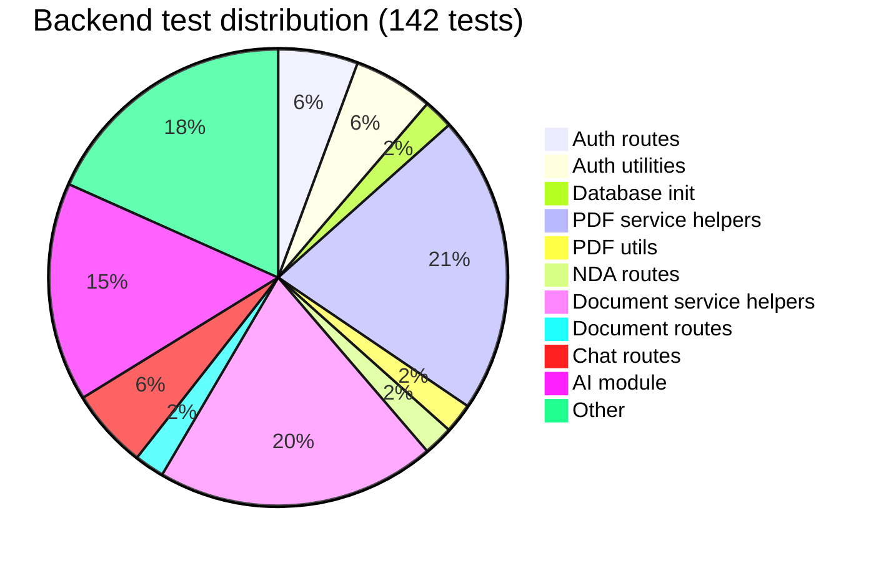
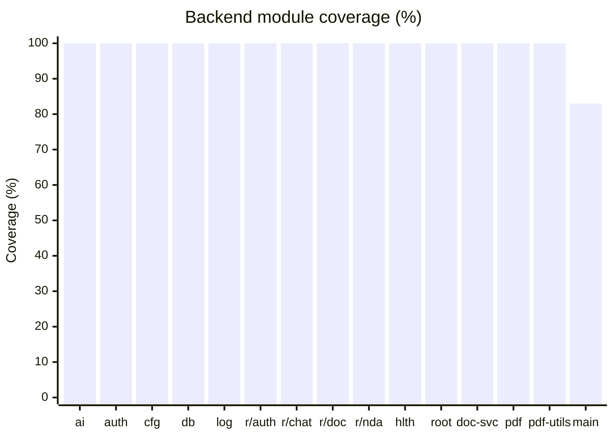
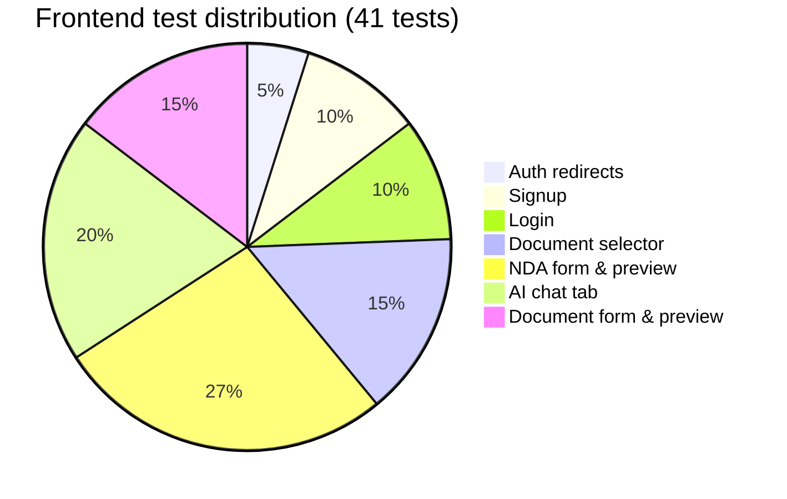
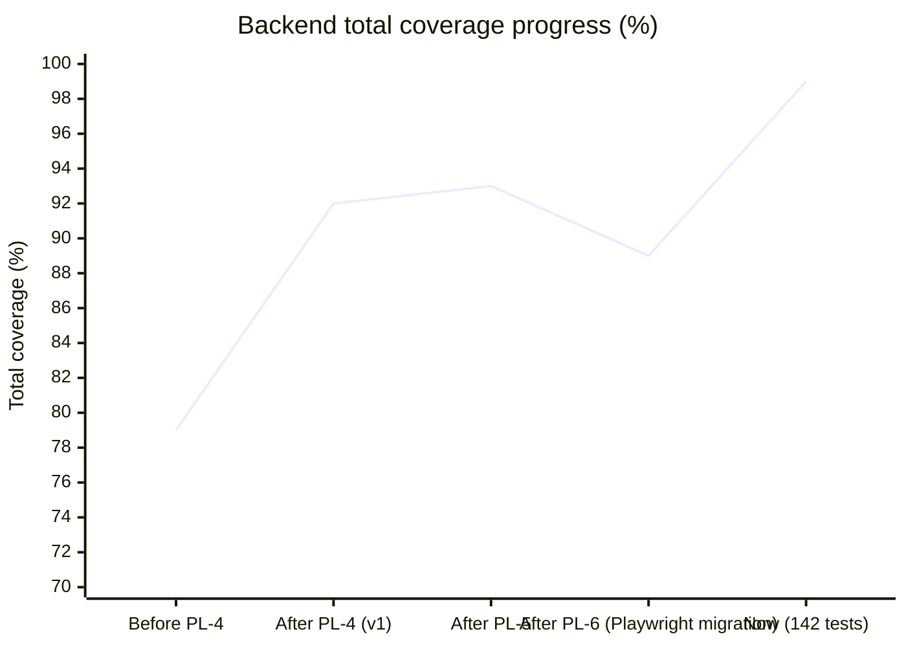

# Test Coverage Report

**Generated:** 2026-03-01
**Backend:** `uv run pytest --cov=app --cov-report=term-missing`
**Frontend:** `bun playwright test` (Playwright e2e, 41 tests)

---

## Summary

| Layer | Tests | Passing | Coverage |
| --- | --- | --- | --- |
| Backend (pytest) | 142 | 142 | 99% |
| Frontend (Playwright e2e) | 41 | 41 | All user flows covered |

Backend is at 99%. The remaining 1% (5 statements in `main.py`) is the JWT warning branch inside the ASGI lifespan and the StaticFiles mount — both require environment setup outside the test runner.

---

## Backend Coverage by Module

```text
app/ai.py                          100%   (28/28 stmts)
app/auth.py                        100%   (22/22 stmts)
app/config.py                      100%   (11/11 stmts)
app/database.py                    100%   (13/13 stmts)
app/logger.py                      100%   (12/12 stmts)
app/routes/__init__.py             100%
app/routes/auth.py                 100%   (35/35 stmts)
app/routes/chat.py                 100%   (20/20 stmts)
app/routes/document.py             100%   (16/16 stmts)
app/routes/health.py               100%    (5/5 stmts)
app/routes/nda.py                  100%   (28/28 stmts)
app/routes/root.py                 100%    (5/5 stmts)
app/services/__init__.py           100%
app/services/document_service.py   100%   (49/49 stmts)
app/services/pdf_service.py        100%   (51/51 stmts)
app/services/pdf_utils.py          100%    (9/9 stmts)
app/main.py                         83%   miss: lines 21-24, 47
─────────────────────────────────────────
TOTAL                               99%   (329/334 stmts)
```

### Coverage by test file



### Module coverage heatmap



| Label | Module |
| --- | --- |
| ai | `app/ai.py` |
| auth | `app/auth.py` |
| cfg | `app/config.py` |
| db | `app/database.py` |
| log | `app/logger.py` |
| r/auth | `app/routes/auth.py` |
| r/chat | `app/routes/chat.py` |
| r/doc | `app/routes/document.py` |
| r/nda | `app/routes/nda.py` |
| hlth | `app/routes/health.py` |
| root | `app/routes/root.py` |
| doc-svc | `app/services/document_service.py` |
| pdf | `app/services/pdf_service.py` |
| pdf-utils | `app/services/pdf_utils.py` |
| main | `app/main.py` |

---

## Frontend Coverage (Playwright e2e)

41 tests across 3 spec files cover all primary user flows.



### User flow coverage


**Legend:** Green = covered by tests. Yellow = partially covered (button visible, download not asserted).

---

## Gap Analysis

### Backend gaps

#### `main.py` — 83% (lines 21-24, 47)

- **Lines 21-24:** JWT warning branch inside the ASGI `lifespan` context manager. The `AsyncClient` test fixture doesn't trigger the ASGI lifespan, so this branch is never reached. Would require an `asgi-lifespan` integration or test restructuring.
- **Line 47:** `app.mount(StaticFiles(...))` — only executed when `static/` exists on disk (Docker production). Not present in the test environment.

These are infrastructure concerns rather than application logic and are not worth the test complexity they would require.

### Frontend gaps

| Flow | Status | Notes |
| --- | --- | --- |
| Auth redirect → `/login` | Covered | `/` and `/preview` both tested |
| Signup happy path | Covered | |
| Signup duplicate email | Covered | |
| Login happy path | Covered | |
| Login wrong password | Covered | |
| Login/Signup cross-links | Covered | |
| Document selector renders all types | Covered | |
| Selecting NDA shows form+chat tabs | Covered | |
| Selecting non-NDA shows form+chat tabs | Covered | |
| Back button returns to selector | Covered | |
| Non-NDA PDF button disabled initially | Covered | |
| Non-NDA form submits to /doc-preview | Covered | |
| /doc-preview shows cover data | Covered | |
| /doc-preview fallback (no data) | Covered | |
| /doc-preview Edit button returns to / | Covered | |
| /doc-preview Download PDF visible | Covered | |
| NDA form renders | Covered | |
| NDA validation errors | Covered | |
| NDA → Preview navigation | Covered | |
| Preview shows party data | Covered | |
| Preview fallback (no data) | Covered | |
| Edit button returns to form | Covered | |
| Download PDF button visible | Covered | |
| AI chat tab renders | Covered | |
| AI chat tab is accessible | Covered | |
| Form tab is default | Covered | |
| Send button state (disabled/enabled) | Covered | |
| Preview NDA button disabled initially | Covered | |
| Tab switching works | Covered | |
| **PDF download completes** | **Not covered** | Requires backend running with Playwright Chromium |
| **AI fills form fields via chat** | **Not covered** | Requires live OpenRouter API key |
| **Token expiry / re-login** | **Not covered** | JWT expiry not simulated |
| **Logout** | **Not covered** | No logout UI exists yet |

---

## Coverage progress



---

## Test architecture overview

```mermaid
graph TD
    subgraph Backend ["Backend (pytest + httpx AsyncClient)"]
        C[conftest.py<br/>AsyncClient fixture<br/>isolated SQLite DB]
        T1[test_auth_utils.py<br/>hash, verify, JWT, logger]
        T2[test_auth_routes.py<br/>signup, login, health, root]
        T3[test_database.py<br/>init, columns, idempotent]
        T4[test_pdf_service.py<br/>30 tests: helpers + generate_nda_pdf]
        T4b[test_pdf_utils.py<br/>3 tests: html_to_pdf mocked]
        T5[test_chat_routes.py<br/>auth, doc_type, messages]
        T6[test_ai.py<br/>call_ai, per-doc prompts]
        T7[test_document_service.py<br/>cover HTML, template files, generate_document_pdf]
        T8[test_document_routes.py<br/>generate-pdf endpoint]
        T9[test_nda_routes.py<br/>3 tests: generate-pdf endpoint]
        C --> T1 & T2 & T3 & T5 & T6 & T7 & T8 & T9
    end

    subgraph Frontend ["Frontend (Playwright e2e)"]
        P1[auth.spec.ts<br/>redirects, signup, login]
        P2[nda.spec.ts<br/>form, validation, preview]
        P3[chat.spec.ts<br/>doc selector, chat UI, buttons, doc-preview]
    end

    subgraph App ["Running app"]
        BE[FastAPI :8000]
        FE[Next.js :3000]
    end

    T2 --> BE
    T3 --> BE
    T5 --> BE
    P1 --> FE
    P2 --> FE
    P3 --> FE
    FE --> BE

    style T4 fill:#d4f5d4,stroke:#2a7a2a
    style T4b fill:#d4f5d4,stroke:#2a7a2a
    style T5 fill:#d4f5d4,stroke:#2a7a2a
    style T6 fill:#d4f5d4,stroke:#2a7a2a
    style T7 fill:#d4f5d4,stroke:#2a7a2a
    style T8 fill:#d4f5d4,stroke:#2a7a2a
    style T9 fill:#d4f5d4,stroke:#2a7a2a
    style P3 fill:#d4f5d4,stroke:#2a7a2a
```


