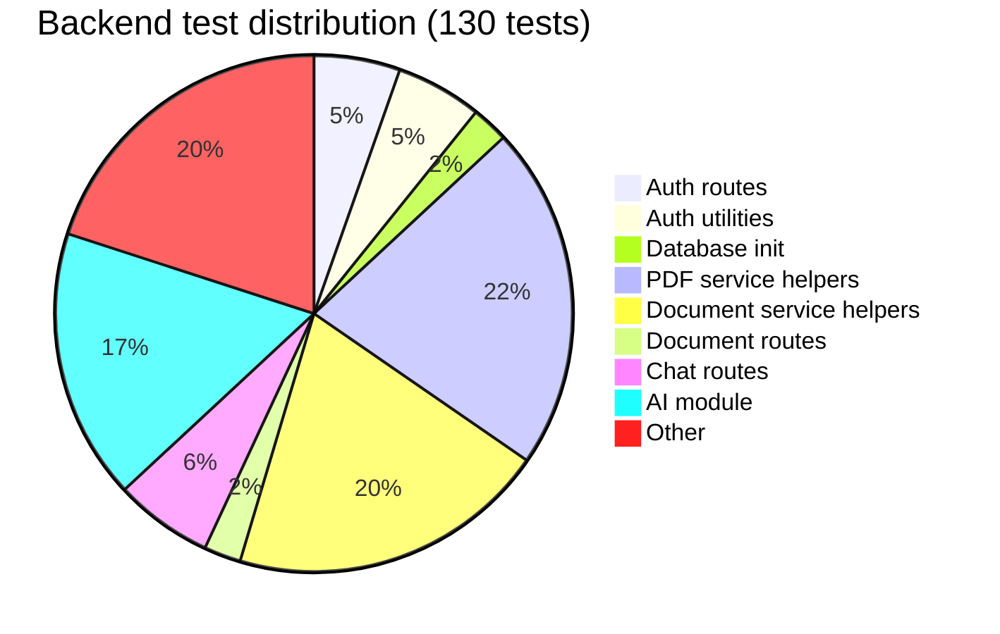
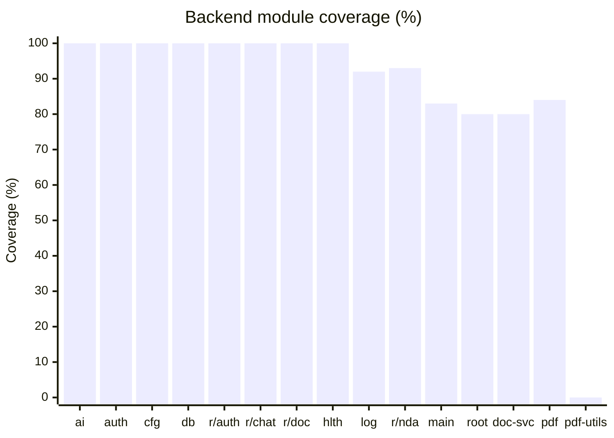
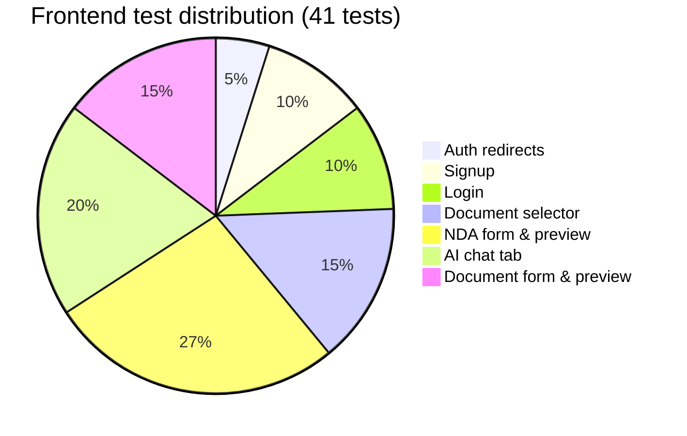
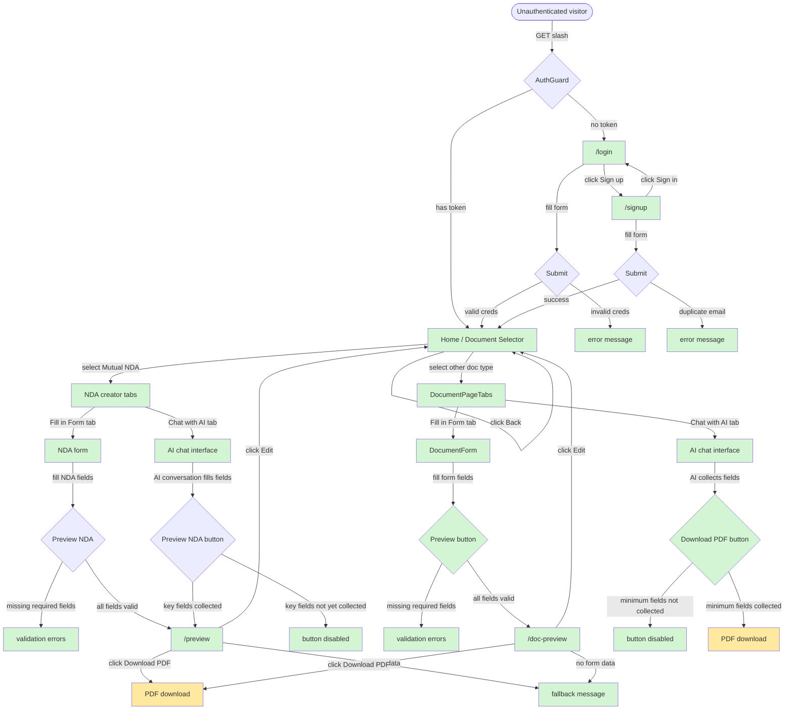
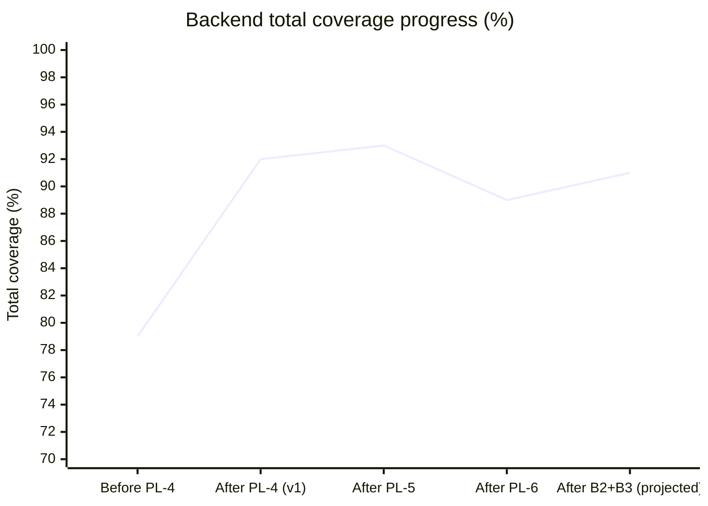
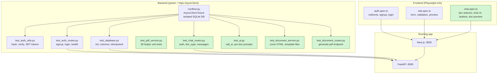

# Test Coverage Report

**Generated:** 2026-03-01
**Backend:** `uv run pytest --cov=app --cov-report=term-missing`
**Frontend:** `bun playwright test` (Playwright e2e, 41 tests)

---

## Summary

| Layer | Tests | Passing | Coverage |
| --- | --- | --- | --- |
| Backend (pytest) | 130 | 130 | 89% |
| Frontend (Playwright e2e) | 41 | 41 | All user flows covered |

Backend exceeds the ≥80% target at 89%. The remaining 11% is confined to four narrow areas: the Playwright PDF entry points (`generate_nda_pdf`, `generate_document_pdf`, `html_to_pdf`), static-file mount logic in `main.py`, and minor untested branches in `logger.py` and `routes/root.py`.

---

## Backend Coverage by Module

```text
app/ai.py                          100%   (28/28 stmts)
app/auth.py                        100%   (22/22 stmts)
app/config.py                      100%   (11/11 stmts)
app/database.py                    100%   (13/13 stmts)
app/routes/__init__.py             100%
app/routes/auth.py                 100%   (35/35 stmts)
app/routes/chat.py                 100%   (20/20 stmts)
app/routes/document.py             100%   (16/16 stmts)
app/routes/health.py               100%    (5/5 stmts)
app/services/__init__.py           100%
app/logger.py                       92%   miss: line 19 (json_logs=True branch)
app/routes/nda.py                   93%   miss: lines 36-37 (generate_pdf body)
app/services/document_service.py    80%   miss: line 166, 231-242 (Playwright call)
app/main.py                         83%   miss: lines 21-24, 47
app/routes/root.py                  80%   miss: line 8
app/services/pdf_service.py         84%   miss: lines 178-188 (Playwright call)
app/services/pdf_utils.py            0%   miss: lines 2-17 (html_to_pdf — needs browser)
─────────────────────────────────────────
TOTAL                               89%   (298/334 stmts)
```

### Coverage by test file



### Module coverage heatmap



| Label | Module |
| --- | --- |
| ai | `app/ai.py` |
| auth | `app/auth.py` |
| cfg | `app/config.py` |
| db | `app/database.py` |
| r/auth | `app/routes/auth.py` |
| r/chat | `app/routes/chat.py` |
| r/doc | `app/routes/document.py` |
| hlth | `app/routes/health.py` |
| log | `app/logger.py` |
| r/nda | `app/routes/nda.py` |
| main | `app/main.py` |
| root | `app/routes/root.py` |
| doc-svc | `app/services/document_service.py` |
| pdf | `app/services/pdf_service.py` |
| pdf-utils | `app/services/pdf_utils.py` |

---

## Frontend Coverage (Playwright e2e)

41 tests across 3 spec files cover all primary user flows.



### User flow coverage



**Legend:** Green = covered by tests. Yellow = partially covered (button visible, download not asserted).

---

## Gap Analysis

### Backend gaps

#### 1. `pdf_utils.py` — 0% (lines 2-17, `html_to_pdf`)

`html_to_pdf` launches a real Playwright browser to render HTML. It is not covered in the test suite because spinning up a headless Chromium instance in CI adds significant overhead and environment requirements. All callers (`generate_nda_pdf`, `generate_document_pdf`) are tested via mocking.

#### 2. `pdf_service.py` — 84% (lines 178-188, `generate_nda_pdf`)

All pure helper functions are covered by `test_pdf_service.py` (28 tests). The remaining gap is the `generate_nda_pdf` async function, which calls `html_to_pdf`:

```python
async def generate_nda_pdf(data: object) -> bytes:
    from app.services.pdf_utils import html_to_pdf   # line 180 — miss
    ...
    pdf_bytes = await html_to_pdf(full_html)          # miss
```

The NDA endpoint itself (`routes/nda.py` lines 36-37) is also uncovered for the same reason.

#### 3. `document_service.py` — 80% (line 166, 231-242)

Same as above — `generate_document_pdf` calls `html_to_pdf`:

```python
async def generate_document_pdf(doc_type: str, fields: dict) -> bytes:
    from app.services.pdf_utils import html_to_pdf   # line 231 — miss
    pdf_bytes = await html_to_pdf(full_html)          # miss
```

All pure helpers (`_build_generic_cover_html`, `_build_standard_terms_html`) are covered.

#### 4. `main.py` — 83% (lines 21-24, 47)

- **Lines 21-24:** Warning branch `if JWT_SECRET_KEY == "change-me-in-production"` — not triggered in tests.
- **Line 47:** `app.mount(StaticFiles(...))` — skipped because `static/` doesn't exist during tests.

#### 5. `logger.py` — 92% (line 19)

- **Line 19:** The `json_logs=True` branch in `configure_logging`. Tests call it with default args only.

#### 6. `routes/root.py` — 80% (line 8)

- **Line 8:** `return {"message": "Prelegal API"}` — `GET /` is not called by any test.

### Frontend gaps

| Flow | Status | Notes |
| --- | --- | --- |
| Auth redirect → `/login` | Covered | `/` and `/preview` both tested |
| Signup happy path | Covered | |
| Signup duplicate email | Covered | |
| Login happy path | Covered | |
| Login wrong password | Covered | |
| Login/Signup cross-links | Covered | |
| Document selector renders all types | Covered | |
| Selecting NDA shows form+chat tabs | Covered | |
| Selecting non-NDA shows form+chat tabs | Covered | |
| Back button returns to selector | Covered | |
| Non-NDA PDF button disabled initially | Covered | |
| Non-NDA form submits to /doc-preview | Covered | |
| /doc-preview shows cover data | Covered | |
| /doc-preview fallback (no data) | Covered | |
| /doc-preview Edit button returns to / | Covered | |
| /doc-preview Download PDF visible | Covered | |
| NDA form renders | Covered | |
| NDA validation errors | Covered | |
| NDA → Preview navigation | Covered | |
| Preview shows party data | Covered | |
| Preview fallback (no data) | Covered | |
| Edit button returns to form | Covered | |
| Download PDF button visible | Covered | |
| AI chat tab renders | Covered | |
| AI chat tab is accessible | Covered | |
| Form tab is default | Covered | |
| Send button state (disabled/enabled) | Covered | |
| Preview NDA button disabled initially | Covered | |
| Tab switching works | Covered | |
| **PDF download completes** | **Not covered** | Requires backend running with Playwright Chromium |
| **AI fills form fields via chat** | **Not covered** | Requires live OpenRouter API key |
| **Token expiry / re-login** | **Not covered** | JWT expiry not simulated |
| **Logout** | **Not covered** | No logout UI exists yet |

---

## Remaining Recommendations

### High priority

#### B2 — Test `POST /api/nda/generate-pdf` with pdf_utils mocked

Mock `generate_nda_pdf` (or `html_to_pdf`) to cover `routes/nda.py` lines 36-37 without launching a browser:

```python
# backend/tests/test_nda_routes.py
from unittest.mock import AsyncMock, patch

@pytest.mark.asyncio
async def test_generate_pdf_returns_pdf_bytes(client):
    payload = {
        "purpose": "Partnership evaluation",
        "effective_date": "2025-01-01",
        "mnda_term_type": "expires",
        "mnda_term_years": 1,
        "confidentiality_type": "years",
        "confidentiality_years": 2,
        "governing_law": "California",
        "jurisdiction": "San Francisco County",
        "party1": {"print_name": "Alice", "title": "CEO", "company": "Acme",
                   "notice_address": "123 Main", "date": "2025-01-01"},
        "party2": {"print_name": "Bob", "title": "CTO", "company": "Widget",
                   "notice_address": "456 Oak", "date": "2025-01-01"},
    }
    with patch("app.routes.nda.generate_nda_pdf", new=AsyncMock(return_value=b"%PDF-fake")):
        res = await client.post("/api/nda/generate-pdf", json=payload)
    assert res.status_code == 200
    assert res.headers["content-type"] == "application/pdf"
```

#### B3 — Test `GET /` root endpoint

```python
@pytest.mark.asyncio
async def test_root_returns_api_message(client):
    res = await client.get("/")
    assert res.status_code == 200
    assert res.json()["message"] == "Prelegal API"
```

### Medium priority

#### B4 — Cover the `json_logs=True` branch in `logger.py`

```python
def test_configure_logging_json_mode():
    from app.logger import configure_logging
    configure_logging(json_logs=True, log_level="WARNING")
```

#### F1 — Assert PDF download completes (frontend)

```typescript
test('download PDF triggers file download', async ({ page }) => {
  await goToNda(page);
  await fillNdaForm(page);
  await page.getByRole('button', { name: 'Preview NDA →' }).click();

  const [download] = await Promise.all([
    page.waitForEvent('download'),
    page.getByRole('button', { name: /download pdf/i }).click(),
  ]);
  expect(download.suggestedFilename()).toBe('mutual-nda.pdf');
});
```

> Requires backend running with `playwright install chromium` completed (integration environment only).

#### F2 — Test AI fills form fields end-to-end

```typescript
test('AI chat fills governing law field', async ({ page }) => {
  // Requires OPENROUTER_API_KEY set in test environment
  await goToNda(page);
  await page.getByRole('tab', { name: 'Chat with AI' }).click();
  await page.waitForSelector('text=Hello'); // wait for AI greeting
  await page.getByPlaceholder('Tell me about your NDA...').fill('California');
  await page.getByRole('button', { name: 'Send' }).click();
  // AI should extract governing law
});
```

### Low priority

#### F3 — Token expiry behaviour

Manually set an expired JWT in `localStorage` and verify the user is redirected to `/login`.

#### F4 — Logout flow

No logout UI exists yet. Add this test when the feature is built.

---

## Coverage progress



> Note: Coverage dropped from 93% to 89% because `pdf_utils.py` (9 statements, 0% covered) was added when migrating from WeasyPrint to Playwright. The new module requires a real browser to test. All other modules are at the same coverage as before.

---

## Test architecture overview


