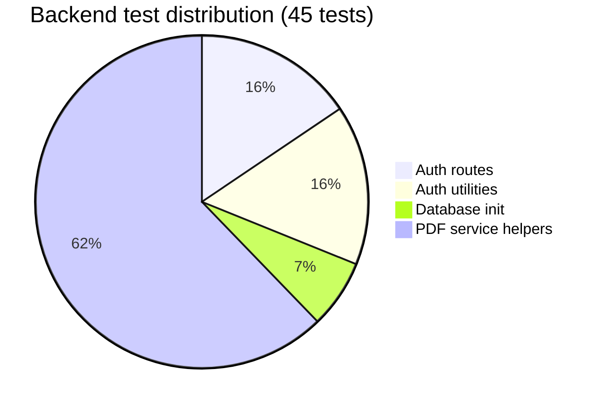
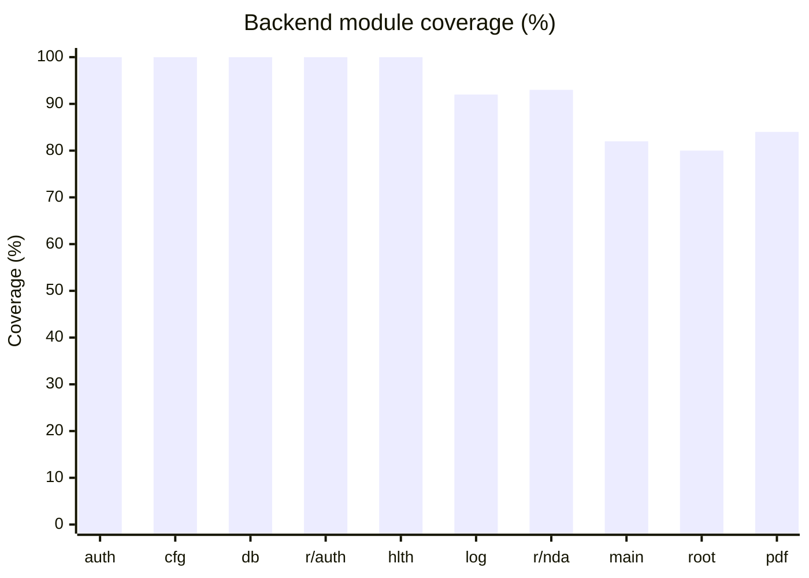
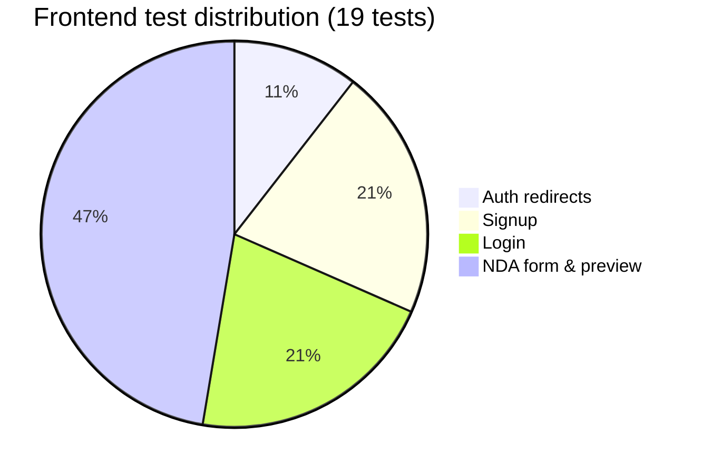
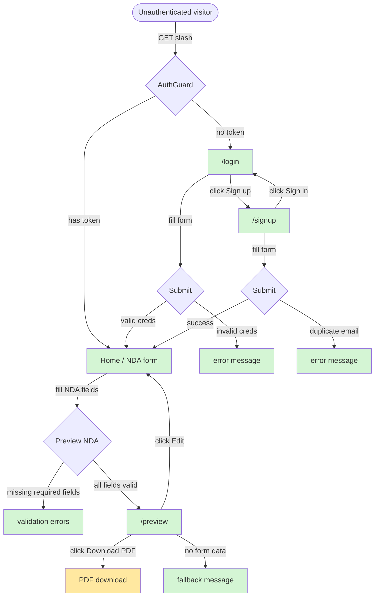
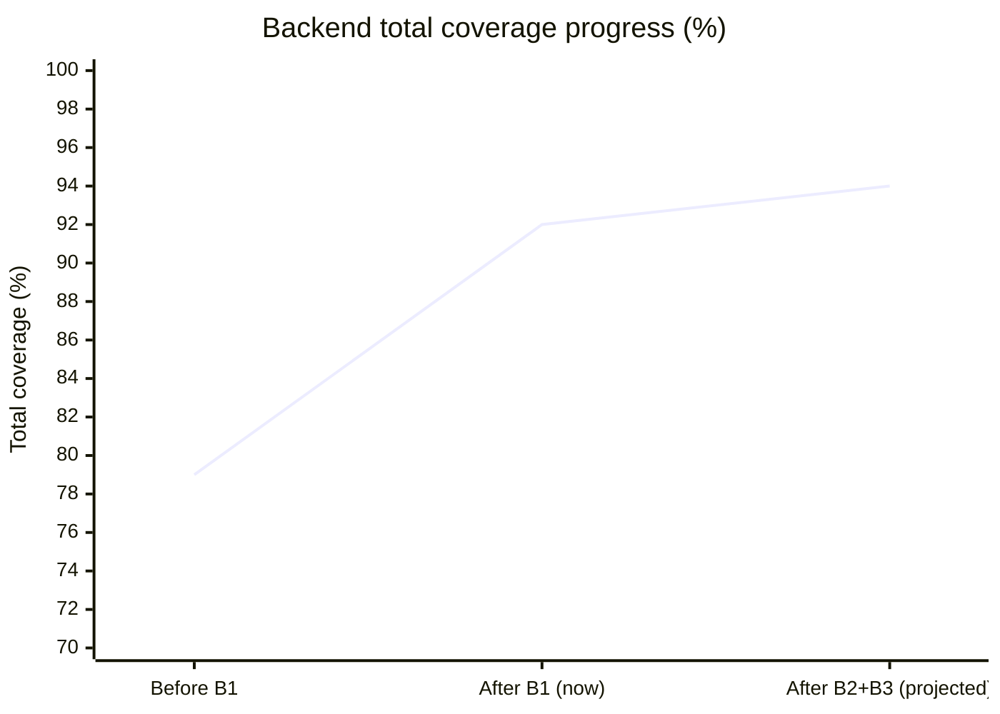
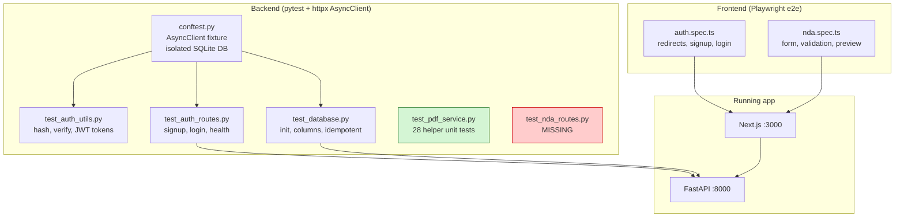

# Test Coverage Report

**Generated:** 2026-03-01
**Backend:** `uv run pytest --cov=app --cov-report=term-missing`
**Frontend:** `bun playwright test` (Playwright e2e, 19 tests)

---

## Summary

| Layer | Tests | Passing | Coverage |
| --- | --- | --- | --- |
| Backend (pytest) | 45 | 45 | 92% |
| Frontend (Playwright e2e) | 19 | 19 | All user flows covered |

Backend exceeds the ≥80% target at 92%. The remaining 8% is confined to three narrow areas: the WeasyPrint entry point (`generate_nda_pdf`), static-file mount logic in `main.py`, and two minor branches in `logger.py` and `routes/root.py`.

---

## Backend Coverage by Module

```text
app/auth.py                 100%   (14/14 stmts)
app/config.py               100%   (10/10 stmts)
app/database.py             100%   (13/13 stmts)
app/routes/__init__.py      100%
app/routes/auth.py          100%   (35/35 stmts)
app/routes/health.py        100%    (5/5 stmts)
app/services/__init__.py    100%
app/logger.py                92%   miss: line 19 (json_logs=True branch)
app/routes/nda.py            93%   miss: lines 36-37 (generate_pdf body)
app/main.py                  82%   miss: lines 21-24, 45
app/routes/root.py           80%   miss: line 8
app/services/pdf_service.py  84%   miss: lines 178-188 (WeasyPrint call)
─────────────────────────────────
TOTAL                        92%   (184/201 stmts)
```

### Coverage by test file



### Module coverage heatmap



| Label | Module |
| --- | --- |
| auth | `app/auth.py` |
| cfg | `app/config.py` |
| db | `app/database.py` |
| r/auth | `app/routes/auth.py` |
| hlth | `app/routes/health.py` |
| log | `app/logger.py` |
| r/nda | `app/routes/nda.py` |
| main | `app/main.py` |
| root | `app/routes/root.py` |
| pdf | `app/services/pdf_service.py` |

---

## Frontend Coverage (Playwright e2e)

19 tests across 2 spec files cover all primary user flows.



### User flow coverage



**Legend:** Green = covered by tests. Yellow = partially covered (button visible, download not asserted).

---

## Gap Analysis

### Backend gaps

#### 1. `pdf_service.py` — 84% (lines 178-188, `generate_nda_pdf`)

All pure helper functions are now covered by `test_pdf_service.py` (28 tests). The remaining gap is the `generate_nda_pdf` async function, which calls WeasyPrint directly:

```python
async def generate_nda_pdf(data: object) -> bytes:
    from weasyprint import HTML          # line 180 — miss
    ...
    pdf_bytes = HTML(string=full_html).write_pdf()  # miss
```

**Root cause:** WeasyPrint requires system libraries (`libpango`, fonts) not guaranteed in the test environment. The endpoint itself (`routes/nda.py` lines 36-37) is also uncovered for the same reason.

#### 2. `main.py` — 82% (lines 21-24, 45)

- **Lines 21-24:** Warning branch `if JWT_SECRET_KEY == "change-me-in-production"` — not triggered in tests (fixture uses the default secret but startup runs via lifespan context).
- **Line 45:** `app.mount(StaticFiles(...))` — skipped because `static/` doesn't exist during tests.

#### 3. `logger.py` — 92% (line 19)

- **Line 19:** The `json_logs=True` branch in `configure_logging`. Tests call it with default args only.

#### 4. `routes/root.py` — 80% (line 8)

- **Line 8:** `return {"message": "Prelegal API"}` — `GET /` is not called by any test.

### Frontend gaps

| Flow | Status | Notes |
| --- | --- | --- |
| Auth redirect → `/login` | Covered | `/` and `/preview` both tested |
| Signup happy path | Covered | |
| Signup duplicate email | Covered | |
| Login happy path | Covered | |
| Login wrong password | Covered | |
| Login/Signup cross-links | Covered | |
| NDA form renders | Covered | |
| NDA validation errors | Covered | |
| NDA → Preview navigation | Covered | |
| Preview shows party data | Covered | |
| Preview fallback (no data) | Covered | |
| Edit button returns to form | Covered | |
| Download PDF button visible | Covered | |
| **PDF download completes** | **Not covered** | Requires backend running with WeasyPrint |
| **Token expiry / re-login** | **Not covered** | JWT expiry not simulated |
| **Logout** | **Not covered** | No logout UI exists yet |
| **Form data persists on back-nav** | **Not covered** | Zustand in-memory; not verified |

---

## Remaining Recommendations

### High priority

#### B2 — Test `POST /api/nda/generate-pdf` with WeasyPrint mocked

Mock `generate_nda_pdf` to cover `routes/nda.py` lines 36-37 without the system dependency:

```python
# backend/tests/test_nda_routes.py
from unittest.mock import AsyncMock, patch

@pytest.mark.asyncio
async def test_generate_pdf_returns_pdf_bytes(client):
    payload = {
        "purpose": "Partnership evaluation",
        "effective_date": "2025-01-01",
        "mnda_term_type": "expires",
        "mnda_term_years": 1,
        "confidentiality_type": "years",
        "confidentiality_years": 2,
        "governing_law": "California",
        "jurisdiction": "San Francisco County",
        "party1": {"print_name": "Alice", "title": "CEO", "company": "Acme",
                   "notice_address": "123 Main", "date": "2025-01-01"},
        "party2": {"print_name": "Bob", "title": "CTO", "company": "Widget",
                   "notice_address": "456 Oak", "date": "2025-01-01"},
    }
    with patch("app.routes.nda.generate_nda_pdf", new=AsyncMock(return_value=b"%PDF-fake")):
        res = await client.post("/api/nda/generate-pdf", json=payload)
    assert res.status_code == 200
    assert res.headers["content-type"] == "application/pdf"

@pytest.mark.asyncio
async def test_generate_pdf_missing_field_returns_422(client):
    res = await client.post("/api/nda/generate-pdf", json={"purpose": "test"})
    assert res.status_code == 422
```

#### B3 — Test `GET /` root endpoint

One addition to an existing test file:

```python
@pytest.mark.asyncio
async def test_root_returns_api_message(client):
    res = await client.get("/")
    assert res.status_code == 200
    assert res.json()["message"] == "Prelegal API"
```

### Medium priority

#### B4 — Cover the `json_logs=True` branch in `logger.py`

```python
def test_configure_logging_json_mode():
    from app.logger import configure_logging
    configure_logging(json_logs=True, log_level="WARNING")  # must not raise
```

#### F1 — Assert PDF download completes (frontend)

```typescript
test('download PDF triggers file download', async ({ page }) => {
  await signUp(page);
  await fillNdaForm(page);
  await page.getByRole('button', { name: 'Preview NDA →' }).click();

  const [download] = await Promise.all([
    page.waitForEvent('download'),
    page.getByRole('button', { name: /download pdf/i }).click(),
  ]);
  expect(download.suggestedFilename()).toBe('mutual-nda.pdf');
});
```

> Requires backend running with WeasyPrint available (integration environment only).

#### F2 — Test form data persists when navigating back from preview

```typescript
test('form data is retained when editing from preview', async ({ page }) => {
  await signUp(page);
  await fillNdaForm(page);
  await page.getByRole('button', { name: 'Preview NDA →' }).click();
  await page.getByRole('button', { name: /← edit/i }).click();
  await expect(page.locator("input[name='party1.company']")).toHaveValue('Acme Corp');
});
```

### Low priority

#### F3 — Token expiry behaviour

Manually set an expired JWT in `localStorage` and verify the user is redirected to `/login`. Requires crafting a token with a past `exp` claim or mocking the time.

#### F4 — Logout flow

No logout UI exists yet. Add this test when the feature is built.

---

## Coverage progress



---

## Test architecture overview


