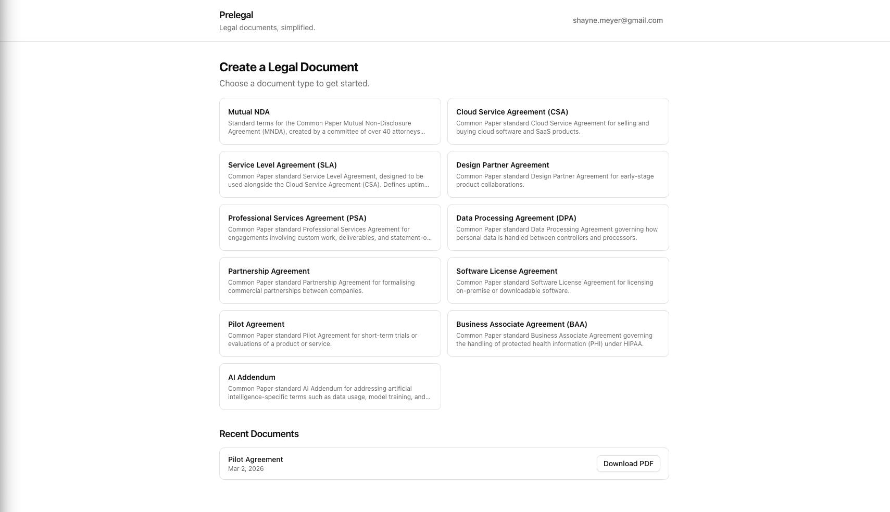

# Prelegal

> **Status: Work in Progress** — Active development, target completion **March 6, 2026**.

Prelegal is a legal document platform that helps users create, preview, and download standard legal agreements without a lawyer.

> [!WARNING] This is not a replacement for legal advice
> Always seek counsel from an attorney and have them review these documents.  
> This is NOT a subsitute for good legal advice.

## What's been built



### Legal document templates (`templates/`)

A dataset of 12 open-source legal agreement templates sourced from [Common Paper](https://commonpaper.com), created by a committee of 40+ attorneys. Licensed under CC BY 4.0.

| Template                              | File                            |
| ------------------------------------- | ------------------------------- |
| Mutual NDA Cover Page                 | `Mutual-NDA-coverpage.md`       |
| Mutual NDA                            | `Mutual-NDA.md`                 |
| Cloud Service Agreement (CSA)         | `CSA.md`                        |
| Service Level Agreement (SLA)         | `sla.md`                        |
| Design Partner Agreement              | `design-partner-agreement.md`   |
| Professional Services Agreement (PSA) | `psa.md`                        |
| Data Processing Agreement (DPA)       | `DPA.md`                        |
| Partnership Agreement                 | `Partnership-Agreement.md`      |
| Software License Agreement            | `Software-License-Agreement.md` |
| Pilot Agreement                       | `Pilot-Agreement.md`            |
| Business Associate Agreement (BAA)    | `BAA.md`                        |
| AI Addendum                           | `AI-Addendum.md`                |

### Legal Document Creator (`frontend/` + `backend/`)

A full-stack web app for generating legal documents from any supported template:

1. **Sign up / sign in** — JWT-authenticated accounts with sign-out in the header
2. **Select a document type** — choose from all 12 supported document types
3. **Fill in a form or chat with AI** — every document type offers both a structured form (default) and an AI chat tab
4. **Preview and download** — submitting the form shows a preview with the cover page and standard terms; download as PDF from the preview
5. **Document history** — previously generated documents appear on the home page and can be re-downloaded at any time

The AI assistant knows the fields required for each document type, always asks follow-up questions when more information is needed, and gracefully handles requests for unsupported document types by explaining alternatives. All generated documents show a disclaimer that they are AI-generated drafts subject to legal review.

## Stack

| Layer          | Technology                          |
| -------------- | ----------------------------------- |
| Frontend       | Next.js 16 + TypeScript + shadcn/ui |
| State          | Zustand                             |
| Validation     | Zod + react-hook-form               |
| Backend        | FastAPI (Python) + uv               |
| Database       | SQLite                              |
| Auth           | JWT (python-jose + bcrypt)          |
| AI             | OpenRouter (openai SDK)             |
| PDF generation | Playwright (headless Chromium)      |
| Deployment     | Single Docker container             |

## Running

### Docker (recommended)

Requires [Docker](https://docs.docker.com/get-docker/).

```bash
# Mac
./scripts/start-mac.sh     # builds image and starts container
./scripts/stop-mac.sh      # stops and removes container

# Linux
./scripts/start-linux.sh
./scripts/stop-linux.sh

# Windows (PowerShell)
./scripts/start-windows.ps1
./scripts/stop-windows.ps1
```

App runs at **http://localhost:8000**. The SQLite database is created fresh on each container start and persisted to a Docker volume (`prelegal-data`).

To use a custom port:

```bash
PORT=9000 ./scripts/start-mac.sh
```

To run without the scripts:

```bash
docker build -t prelegal .
docker run -d --name prelegal -p 8000:8000 -v prelegal-data:/data prelegal
docker stop prelegal && docker rm prelegal   # stop
```

### Local development

Run backend and frontend in separate terminals.

**Terminal 1 — backend:**

```bash
cd backend
uv sync
uv run playwright install chromium   # one-time: installs headless Chromium for PDF generation
uv run uvicorn app.main:app --reload
# Runs on http://localhost:8000
```

**Terminal 2 — frontend:**

```bash
cd frontend
bun install
cp .env.local.example .env.local   # sets NEXT_PUBLIC_API_URL=http://localhost:8000
bun dev
# Runs on http://localhost:3000
```

## Testing

```bash
# Backend (from backend/)
uv run pytest --cov=app --cov-report=term-missing   # 99% coverage, 155 tests

# Frontend (from frontend/)
bun playwright test                                  # 42 e2e tests
```

See [`docs/test-coverage-report.md`](docs/test-coverage-report.md) for full coverage details and gap analysis.

## Progress

- [x] Legal document template dataset (12 templates)
- [x] V1 foundation: Docker, SQLite, JWT auth, start/stop scripts
- [x] Mutual NDA creator (form → preview → PDF download)
- [x] AI chat for NDA drafting (freeform chat auto-fills the form)
- [x] All 12 document types supported via AI-guided chat + PDF generation
- [x] Multi-user support: document history, sign-out, legal disclaimer (PL-7)
- [x] Session timeout: 10-min inactivity logout, JWT refresh endpoint (PL-8)
- [x] Backend tests (99% coverage, 155 tests) and frontend e2e tests (42 flows)
- [ ] Release
